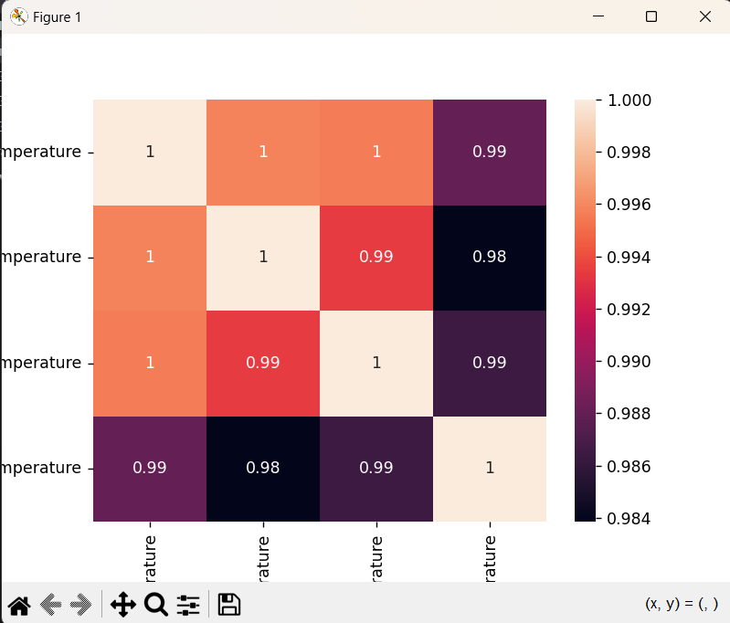

# 🌍 Global Temperature Predictor

This project is a machine learning-based weather prediction system that forecasts **Land and Ocean Average Temperatures** using historical climate data.

---

## 📌 Project Overview

With increasing concern about climate change, forecasting global temperatures plays a crucial role in environmental planning and awareness. This project uses a **Random Forest Regressor** to predict global temperature trends based on historical data from the **GlobalTemperatures.csv** dataset.

---

## 📊 Features

- 📈 Predicts Land and Ocean Average Temperature (°F)
- 📅 Extracts and uses `Year` as a temporal feature
- 🔍 Visualizes correlation using heatmaps
- ✅ Baseline and model comparison using MAPE
- 🧠 Model built using Scikit-learn pipeline
- 💾 Model saved with Joblib for future use
- 📉 Plots Actual vs Predicted Temperatures

---

## 🛠️ Tech Stack

- **Language:** Python  
- **Libraries:**
  - `pandas`, `numpy` – Data preprocessing
  - `matplotlib`, `seaborn` – Visualization
  - `scikit-learn` – Modeling & evaluation
  - `joblib` – Model serialization

---

## 📁 Dataset

- **Source:** [Kaggle – GlobalTemperatures.csv](https://www.kaggle.com/datasets/berkeleyearth/climate-change-earth-surface-temperature-data)
- **Fields used:**
  - LandAverageTemperature
  - LandMaxTemperature
  - LandMinTemperature
  - LandAndOceanAverageTemperature

---

## 🔍 How It Works

1. **Data Cleaning:**
   - Dropped uncertainty columns
   - Converted temperatures from °C to °F
   - Extracted year and removed early entries (<1850)

2. **Feature Selection:**
   - Inputs: LandAvgTemp, LandMaxTemp, LandMinTemp
   - Target: LandAndOceanAverageTemperature

3. **Modeling:**
   - Split into train/test
   - Created baseline using mean prediction
   - Trained `RandomForestRegressor` inside a pipeline

4. **Evaluation:**
   - Measured accuracy using MAPE
   - Visualized predictions vs actual values

---

## 📸 Output Screenshot

  
*Replace with your actual plot screenshot*

---

## ✅ Results

- **Baseline Accuracy:** ~50%
- **Random Forest Accuracy:** ~86.5%

---

## 🚀 Future Enhancements

- Include seasonal/month data
- Try LSTM or ARIMA for time-series modeling
- Deploy using Streamlit or Flask
- Add external climate variables (e.g., CO₂ levels)

---

## 📎 License

This project is for educational purposes.

---

## 🙌 Acknowledgments

- Dataset by Berkeley Earth via Kaggle  
- Scikit-learn documentation for model setup  
- Python community for amazing tools and support!

---

## 🔗 Connect with Me

- GitHub: [yourusername](https://github.com/yourusername)  
- Email: [youremail@example.com](mailto:youremail@example.com)

